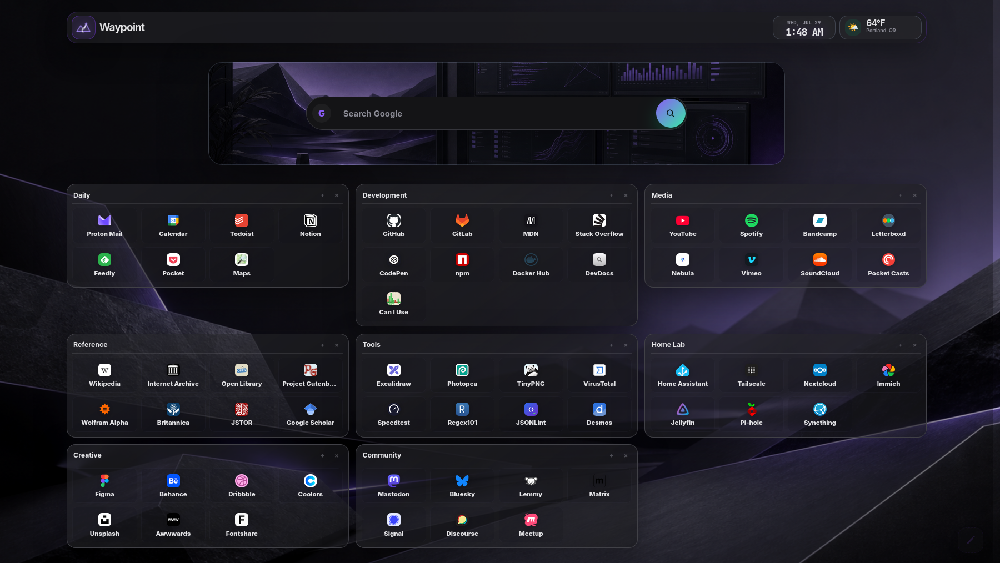
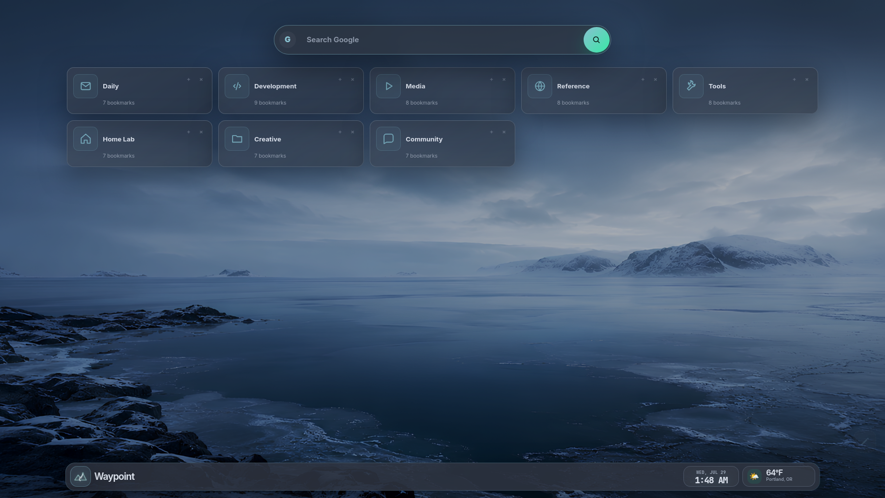
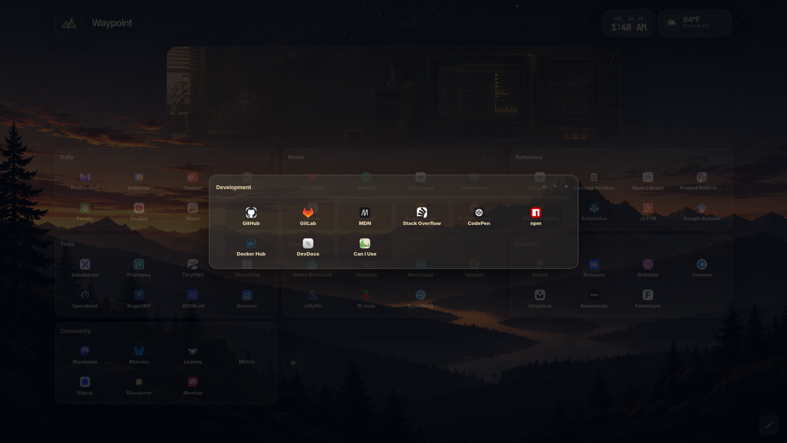
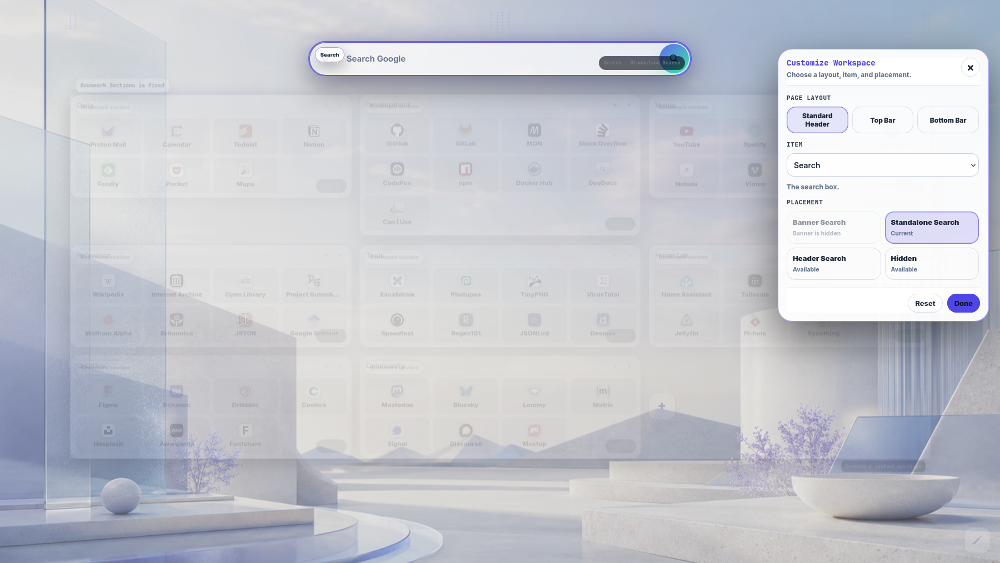
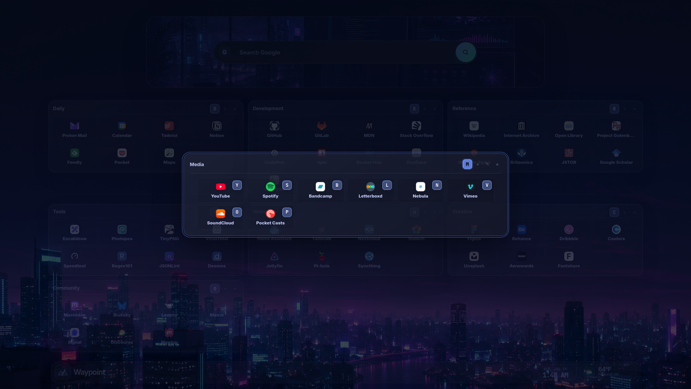
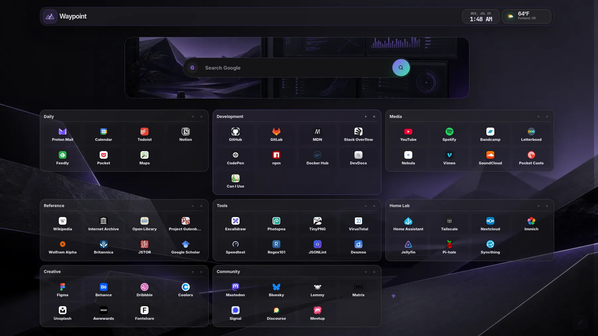

# Waypoint

<div align="center">


## Waypoint is a modern, local-first browser start page designed to be fast, customizable, and beautiful by default.

*It exists because I couldn't find a start page I wanted to use every day. So I built one.*

<p>
  
  
  
</p>

</div>

---

<div align="center">



</div>

---

## Features

### 📚 Bookmarks

- Drag and drop bookmark management
- Grid Cards, Compact Cards, and Focused Section views
- Automatic website icons and organized sections

### 🎨 Customization

- Multiple layouts, themes, wallpapers, and banners
- Workspace Studio for visual customization
- Extensive appearance and color options

### ⌨️ Productivity

- WaypointKeys keyboard navigation
- Integrated terminal with built-in commands
- Zero build process and instant startup

### 🔒 Privacy

- Local-first by design
- Runs directly from `file://` or any web server
- No accounts or cloud services required

---

## Screenshots

<div align="center">







<h3>Terminal Demo</h3>



</div>

---

## Installation

Clone the repository:

```bash
git clone https://github.com/waypointsp-dev/waypointsp.git
```

Or download the latest release from the Releases page.

Open `index.html` in your browser.

No installation required.

---

## Customization

Waypoint is designed to be personalized.

Customize themes, wallpapers, layouts, widgets, colors, banners, bookmarks, and more to create a workspace that feels like your own.

---

## Project Status

**Latest Public Release:** **v1.5.2**

**Current Main Branch:** **v1.5.2**

**Development Status:** no active development milestone

---

## License

Copyright (C) 2026 fluxwrk

Licensed under the GNU General Public License v3.0 or later.

See the LICENSE file for details.
